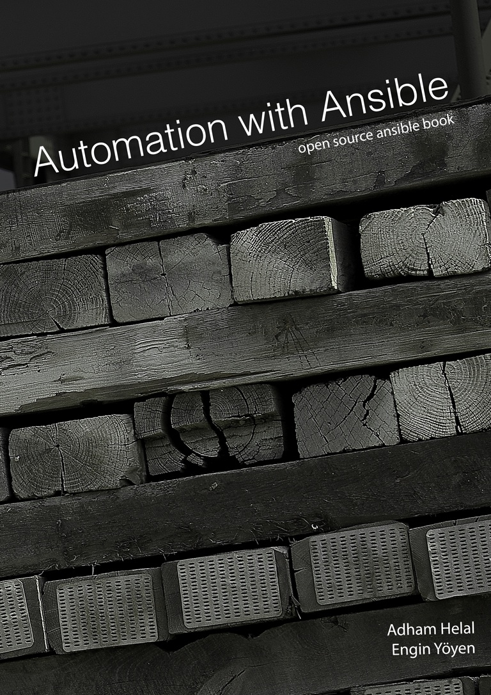

I and my dear friend Adham has started working on an open source ansible(open-source automation and orchestration engine) book project back in January.

We have finally put some effort to make the initial release. Currently there are 8 Chapters in the book, however from here on we want to improve and add new chapters in future, which also means anyone who want to write a chapter, or make a correction is welcome to do so. Therefore initial version will only contain several chapters, and we will try our best to add new chapters and make corrections.

Here is the URL:

<https://github.com/AutomationWithAnsible/AutomationWithAnsible>

_**Engin!**_