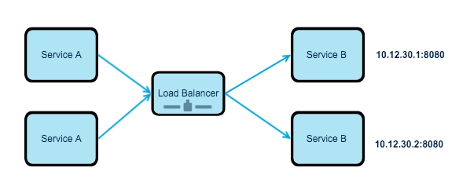
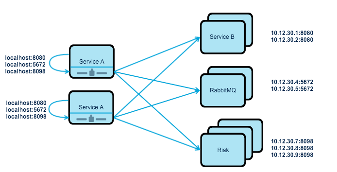

Distributed load balancing, is an approach to use load balancing on each service to connect to the attached resources. This is an approach that can be very useful for building micro-services or service oriented architecture, where you have many resources(e.g. email-service, notification, message-queue, NoSQL database) that connects each other or requires other services to complete some sort of functionality.

In today&#8217;s standards, scalability is a part of a system design. As soon as the demand of the system increases, there comes the need to increase the capacity (e.g. CPU, memory, etc). Historically most systems have been designed in a way to scale-up, or in other terms vertical scalability, meaning, adding more resources to a single server. A good example of this is database servers. Horizontal scalability, on the other hand, solves the same resource problem by adding more servers, which also being referred as scaling-out.

<!--more-->

Nevertheless, horizontal scalability brings a new problem, if you have 10 service doing the same job, which one to connect, to put simply how to distribute the traffic? Solution to this, of course, distributing incoming traffic to the pool of resources or servers by load balancing.

_PS:_ In this article the definition “_attached resourced_” is used for any service the app consumes over the network as part of its normal operation(e.g. a micro-service, MySQL, RabbitMQ, Postfix)(see [Backing-Services](http://12factor.net/backing-services)).

### Traditional Load Balancing

The traditional approach for load balancing has been to put a load balancer, a reverse proxy, in front of available resources. For instance, imagine that you have a pool of services, which receives images from web applications and do some sort of image-processing on it. Web applications do not have to be aware of each single service, they have to send all the request to a single IP address, and the load balancer takes the responsibility of the distributing the load across resources. Following diagram outlines the basic idea:

  
This is a reliable solution, but it has it quirks, your load balancer can be overloaded with requests, or your load balancer can fail, which means, there are no longer transactions. It should be handled carefully so it does not become a system bottleneck. But generally speaking, they are reliable and most of the time they do just fine.

&nbsp;

### The Problem

Dividing your application into small pieces, sounds wonderful, but wait till you notice that now you have to take care of service discovery and load balancing. It is not a rocket science, but it requires careful design. Services usually depend on one another, and not to mention there comes a time, where you need to scale your system. The usual scenario, of course, is that you have more than one instance of a service, or several instance of a service clustered. For instance, consider the following diagram, Service A depends on Service B, RabbitMQ and Riak.

  
In this scenario, Service A, has to connect with three different type of attached resource. We could put load balancer front of each type, so there will be three load balancer. This will mean, we solve the problem with traditional load balancing. But it also means you need to add load balancers front of each attached resource. Therefore, the number of the load balancers increase each time you have a type of resource (e.g. a new micro-service). Of course, assuming that you have more than one instance of each resource and that you prefer scaling-out instead of scaling-up.

### Distributed Load Balancing

In distributed load balancing, there are no central load balancers, each client that requires some service uses that service via locally installed reverse-proxy. Reverse-proxy is always up-to-date with existing services, meaning when a new service is being provisioned, reverse-proxy is configuration and it is updated. Reverse-proxy, take cares of the load-balancing, so it is a client-side load-balancing. Every time, a client makes a request, based on the load-balancing strategy, reverse-proxy, distributes the request to the attached resources.

  
As you can see from the figure, all Service A has to know is the exposed port of the attached resource. This information can stay same on all stages, as well as in local development.

### How To Configure It

The configuration of the local load balancers is done dynamically, meaning you need a some kind of service discovery in place. There are good, reliable solutions such as [Consul](https://www.consul.io/), [Apache Zookeeper](https://zookeeper.apache.org/) or [SmartStack](http://nerds.airbnb.com/smartstack-service-discovery-cloud/).

### Where Can it be used

This solution can be used more internally, meaning in the private network for discovering new services and using them immediately. I had the experience of using for available REST APIs, Web Applications, Database, Message Queue and more.

### Application State and Caching

As it is generally preferred to build a stateless application, this approach works just fine. Caching static content, however, might be problematic hence the distributed nature of it.

### Health Checks and Graceful Shutdown

Because the configuration of the load balancing, depends on the service discovery, if for any reason attached-resource fails, load balancer configuration will be updated, therefore the overall system will be much more resilient, and your load balancer does not have to send requests to the dead servers/application. Furthermore, shutting down servers can be handled gracefully, hence the service discovery can send notice to remove the resource from the pool before shutdown.

### Other Advantages

The configuration of the applications becomes simpler, as they move from one stage to another. For instance, if you are developing an API, your basic API configuration can stay same between different stages. This removes configuration issue between different stages, as each stage becomes identical. Furthermore, with distributed load balancing, correlation exist between the client, load balancer, and the service. If the number of requests is raising, so the number of clients, as well as load balancers. If load decreases, so everything else.

### UpShot!

This approach requires a good IT automation and monitoring. It is a very useful approach of building a dynamic system where system components are either diverse or there are many small components, that can be exchanged and add on the fly, without major hassle. A good example of this of course micro-services, which are very hard to handle.
