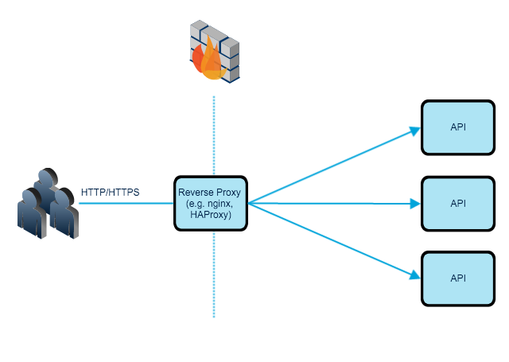

Throttling is the intention of giving limited usage to an available resource you have in your hand. For instance, if you are exposing your API to be used publicly, you may want to limit the usage of the API because of expensive computation, limited resource or simply a financial motive such as the monthly cost for X amount of request. Therefore, you may need to build some kind of API Throttling, which limits the incoming request based on defined criteria.

<!--more-->

Consider the following diagram, you have a single API endpoint that you have exposed to the internet which has multiple instances. Applications are running in a private network and your reverse-proxy retrieves resources on behalf of a client to your applications. How do you limit incoming requests?<figure id="attachment_163" class="thumbnail wp-caption aligncenter" style="width: 650px">

 

&nbsp;

&nbsp;

### Solving the Problem On Reverse Proxy

One of the easiest way to accomplish the limiting API, as well as stopping attacks such DoS, is to activate the build in rate-limiting in your reverse-proxy. Nginx, HAProxy or Apache have rate-limiting modules and methods. This first line of defence will give you the capability to slow down the incoming requests or deny HTTP or TCP connections.

### Solving the Problem On Application Side

Limiting incoming request based on IP is a good solution to stop your server floating with unnecessary requests, but you may need a rather fine-grained solution. Application level limit-requesting gives you also better control, for instance, you may have different read and write rules, for different API endpoints, or different limits on different API endpoints. Furthermore, limiting-request based on an authorised client will give you a better chance to keep track of the usage patterns of clients.
  
The steps, to solve the problem is relatively easy, as one would imagine, you need to keep track of all request. As you may have more than one instance of a service, you should keep track of this information on an in-memory-store, where all instances of the API can access. Every time a request hits to the application:

  * Define a way to identify a client (client-id, access_token, unauthorized request, etc)
  * Check current number of request from the client
  * If current number of request is 
      * bigger than defined rate, return error (e.g. 403 Forbidden or 429 Too Many Requests)
      * smaller than defined rate make allow the operation and increment the counter

The counter you have in in-memory-store should have some expiration dates, so the key will automatically be deleted. If you want to keep track of the complete usage, you may want to keep track of the keys and persist the data in a database before deleting keys. It is much more work, but it is not a rocket-science.

### HTTP Headers

Before you return any errors to your client, you may definitely want to inform them. This is very useful hence the client might be dependent on your system to serve some other content to their customer. Being a humble developer, you decide to add HTTP Headers, which informs the client after every request. Here is an example from github API[https://developer.github.com/v3/#rate-limiting,].

X-RateLimit-Limit : The maximum number of requests that the client is permitted to in giving time-window.
  
X-RateLimit-Remaining: The number of requests remaining in the current rate limit window.
  
X-RateLimit-Reset:The time at which the current rate limit window resets in UTC epoch seconds.

### Building up a Strategy

While firewall and load balancer, can stop flooding a system with unnecessary request or attacks, and API level rate limiting gives control over computational resources, therefore both of the solutions should be used. There are cases, however where you might have multiple APIs which you would like to limit, a solution to that might be simply introducing an API gateway, which handles API throttling in an abstract level, and redirecting all requests.

Strategy, to combine both will also define the guideline that is needed for the using the API. The rules might be that:

A single IP address is allow 1.000 requests per second, after that all request within that seconds will be dropped.
  
Requests without client credentials can make maximum 2.000 daily. Here the important point is that, the quota(2000 request), is shared between different clients under the same IP.
  
Requests with identified client credentials can make maximum 50.000 requests per day.
  
The numbers in this example will of course vary based on your use case, as well as it might be a dynamic quota based on the client.