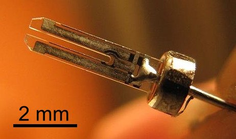

We have been trying to keep track of time for thousands of year. Nowadays, there are hundreds of apps and services to keep track of time in name of increasing human productivity. But, going down to the basics, how do computers keep track of time? Meaning, how a computer knows what a second is and how does it compute it?

Computing devices(computer, servers, mobile phones, etc.) uses a combination of two methods to keep track of time correctly. First, an actual device which computes the time, that is called [Real Time Clock (RTC](https://en.wikipedia.org/wiki/Real-time_clock)). RTC on computers has a separate battery,  this is the reason when you shut down your computer and open again, it can still remember the time, though not so accurate. I will explain how RTC measures a second in next section.

The second method that computing devices uses called [Network Time Protocol (NTP)](https://en.wikipedia.org/wiki/Network_Time_Protocol), which means your computer(which is called client) polls a master clock from a server on a network every 64 seconds(default minimum value).  To synchronize its clock, the client must run an algorithm on a giving data, to eliminate offset, round-trip delay and verify the stability of time. 

## How Does Real Time Clock Works?
Most Real Time Clocks uses Crystal Oscillator, which is also used in quartz wristwatches and many other devices. The principle is as follow, there is a quartz fork as you can see in the following image, it is a very tiny just a couple millimeter size. 

This quartz fork vibrates (move or swing back and forth in a regular rhythm) at about 32768 per second. To vibrate the quartz fork, a voltage from the battery is used, when it is powered created frequency is measured and used as a unit of second. 

Now comes the good part, despite this method is reliable, is not accurate. The quality of the quartz crystal that is used, load that has been provided for operation, the environmental condition such as heat can all affect the accuracy of the frequency. Therefore, the result of inaccurate frequency causes an inaccurate measurement.  

## How does NTP Works (in a nutshell)?
NTP is a way to synchronize the time between computing devices. If you think about it, RTC is a solution keep track of time, but it is not a reliable one, hence the condition of measuring time depends on external factors.  In the age of cloud computing and distributing load between different servers, keeping time correctly between servers became even more important task than before. Servers that share task but have unsynchronized time, can cause a lot of headaches. Backup corruption, (incorrectly) scheduled jobs, audit and debug issues, sorting time-critical information, cryptographic key generation,  (incorrectly) invoice calculation issues are just some of the issues that just pops up to mind immediately. 

NTP client synchronizes its local clock by polling a master clock from a server on a network. NTP has a hierarchical structure, which at level 0(called Stratum 0, but they are not connected to network directly), uses precise hardware clocks that are highly accurate. Stratum 1 servers receive times directly from Stratum 0 devices and act as a primary clock. Stratum 2 receives their time information from Stratum 1 over NTP. Stratum 3 from Stratum 2, and so on and so forth.

There is no solution that is perfect, NTP has its own problems and security issues, but for basic operations that requires accuracy in milliseconds to seconds level, NTP will do a fine job. If you keep up-to-date and connect to multiple external NTP servers, as to do its job fine, it needs several NTP server. 

And last but not least, here is an alternative to NTP, which is called Precision Time Protocol:
[https://en.wikipedia.org/wiki/Precision_Time_Protocol](https://en.wikipedia.org/wiki/Precision_Time_Protocol)