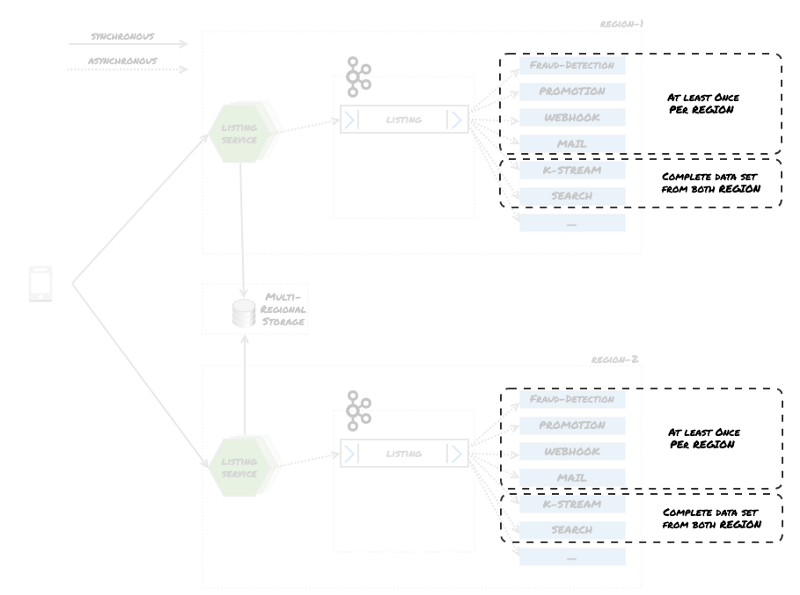
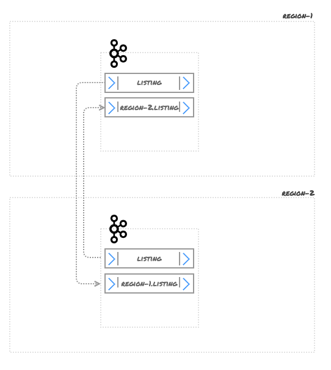
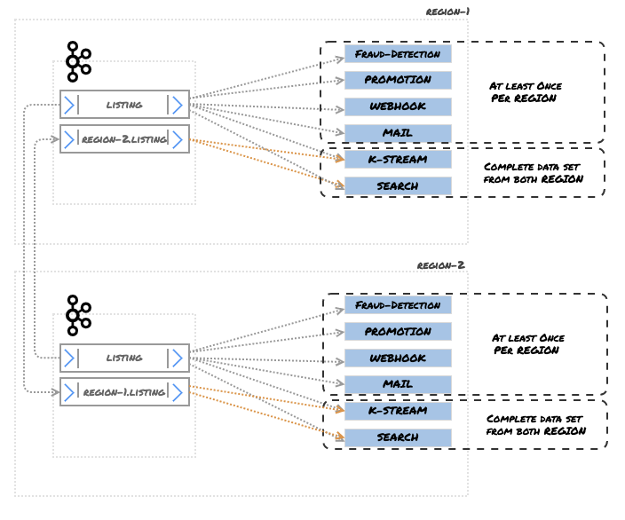
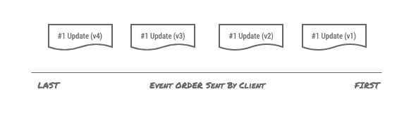
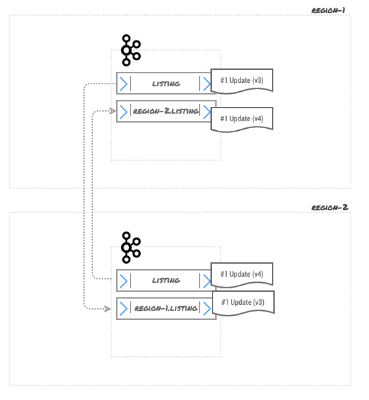
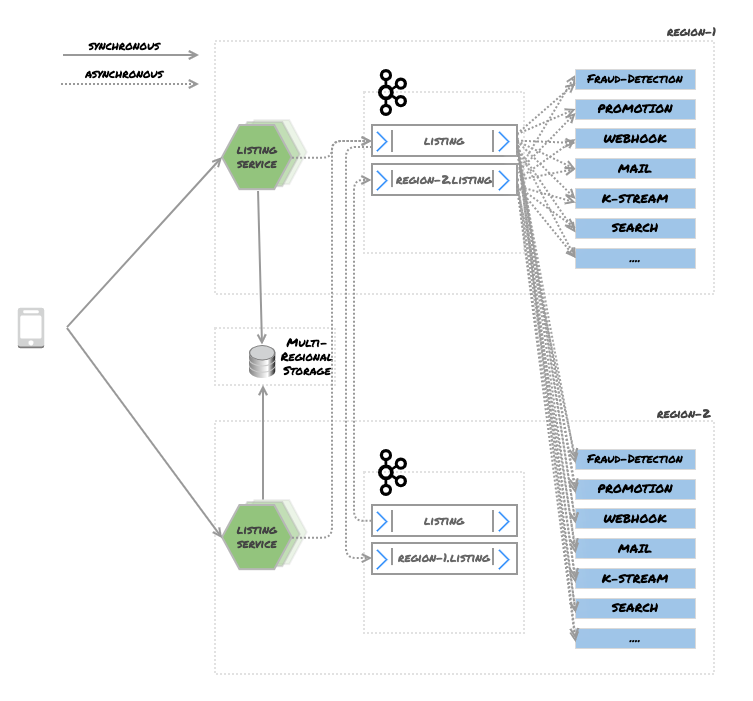

**This article was originally published at: [https://tech.ebayinc.com/engineering/resiliency-and-disaster-recovery-with-kafka](https://tech.ebayinc.com/engineering/resiliency-and-disaster-recovery-with-kafka)**

#### Multi-Region Kafka Setup Using MirrorMaker 2.0
High availability, resilience and scalability have become the standard when building user-facing applications. Cloud computing has been a contributing factor to that.

Previously, having multiple data-centers was a major up-front capital investment — both skill-wise and in terms of hardware. Today, having a disaster recovery plan requires less effort and no up-front investment, thanks to cloud computing. As a result, many consumer-facing applications are now set up in a geographically dispersed fashion. In case of major failure, users are not affected, and latency is reduced for users across the globe.

The Motors Vertical team is part of the [eBay Classifieds Group](https://www.ebayclassifiedsgroup.com) (eCG). As a global organization, we run our software in multi-region (multi-datacenter) setup, where regions are geographically dispersed. From time to time, we do failover exercises where we take down a whole region to verify how systems respond to the outage. We also have automatic failover, so if services have problems in one region, we can divert all traffic to another region. Many of the technologies we use enable us to run applications in a multi-region setup very efficiently and easily, while a small set of technologies makes that difficult.

One of the most critical components in our infrastructure is [Apache Kafka](https://kafka.apache.org)®. — But as important as it is in our architecture, it’s not yet that easy to run a multi-cluster *active/active* Kafka setup.

Although the recent release of [Kafka 2.4](https://www.apache.org/dist/kafka/2.4.0/RELEASE_NOTES.html) has greatly improved support for multiple Kafka clusters with [MirrorMaker 2.0](https://cwiki.apache.org/confluence/display/KAFKA/KIP-382%3A+MirrorMaker+2.0), depending on your use cases it could still give you a headache.

In this article, I will outline a technical scenario that requires ordered events, highlight several challenges, and present possible solutions for running a multi-region Kafka setup.

### Use Case — Multi-Region Setup with Ordered Events

At Motors Vertical (MoVe), we deal with product listings. A listing (or “ad”) is a non-personal message to promote or sell a product, either by a private individual who wants to sell a single item, or a professional organization who sells at a higher quantity. Listings are the core data structures of most classified ads, and everything in our system depends on them.

Several actions are taken whenever a listing is created:

* Check for fraud
* Notify the user that the listing has been successfully published
* Create an index, so the posted listing can be shown in search results
* Add promotions to seller listings
This list gets longer, based on whether the listing has been created, updated, deleted, etc. So each state that the listing is in could trigger a different action.

A high-level view of the system looks something like this:

The listing service has its data storage, which stores listings and serves as the source of truth for that domain. Once a client posts a listing, it is stored in NoSQL data storage, and published to the Kafka brokers. There are a set of clients which consume those messages and take appropriate actions.

If we were running our system in a single region, the setup above would be fine. If we run our software in multiple regions, we might replicate all the software we run in one region to another, so if *region-1* fails, *region-2* could take over.

In that scenario, the system might look like this:

A setup like this allows iOS, Android, Web and API clients to connect to multiple regions. Traffic is routed to the different regions based on load balancing rules. For the sake of simplicity, let’s assume that we are using the [round-robin](https://en.wikipedia.org/wiki/Round-robin_DNS) load-balancing method here. So requests will be handled by multiple regions for the same client.

Any events received in *region-1 *are processed in *region-1*. The problem with this approach is that some of the services require a complete data set to function properly. For instance, for the search API to deliver correct results, it has to index all the listings. Search indexes are not shared, so each region has to hold its own search index. All the data must be available to deliver the same result on both regions.

Since we rely on [Kafka Streams](https://kafka.apache.org/documentation/streams/), for some join operations we require the whole data set. Otherwise joins would not take place, and the data that is produced would be misleading.

From a very high level, services can be grouped into two categories:

1. Services that need to consume the data at least once from the region that they are in
2. Services that need a complete data set, meaning all events across regions
With that in mind, now the diagram should look as follows:

So there are two technical challenges that need to be overcome:

1. Make sure events take place in a region processed by local services   
*(which is done by the design above)*
2. Make sure events are shared across regions  
*(not hard but very problematic)*
Before we move on, it’s worth noting that a Kafka cluster gives you the following guarantee:

*Messages sent by a producer to a particular topic partition will be appended in the order they are sent. That is, if a record M1 is sent by the same producer as a record M2, and M1 is sent first, then M1 will have a lower offset than M2 and appear earlier in the log. (See *[*Kafka Guarantees*](https://kafka.apache.org/intro#intro_guarantees)*)*

It’s worth emphasizing that **this guarantee is for a single cluster** —not for a multi-cluster setup. This is important to keep in mind, and we’ll come back to this point later…

So with our use case and technical challenges in mind, the question we want to answer is:

> *How to run multi-cluster Kafka in a multi-region setup, when event ordering is a must-have feature?*### Solution 1: Active / Active Kafka Cluster With Mirroring Topic

While it’s possible to run an *active/active* Kafka cluster, it’s very problematic with ordered events. Internally, here at MoVe we had our own custom *kafka-mirror-service*, which was born out of necessity because MirrorMaker 1.0 could not fulfil our needs. But in this article, I will focus on the capabilities of MirrorMaker 2.0.

With MirrorMaker 2.0, topics can be mirrored between clusters. MirrorMaker handles the topic creation and synchronisation on its own, which is very very handy. For instance, if a topic called ***listing*** exists in “*region-1*” and “*region-2*”, MirrorMaker creates new topics on both Kafka clusters, prefixed by the defined name:

Now all the ***listing*** items from *region-1* will be mirrored to *region-2* and vice-versa. This solves the problem of accessing complete data sets, as services that require it can now consume multiple topics with a regular expression in the topic name, like .*\.listings , which returns the whole data set.

With replication, we can re-draw *Figure 2* as follows:

This looks like a solution. We can satisfy both groups of services, including those that 1) consume events in the local region at least once, and 2) consume all data across regions.

We do have use cases where the order of events are irrelevant and this solution will work fine for that. But the listings scenario requires events to be consumed in the correct order. Additionally, we use topic compaction for the ***listing*** topic, so this solution becomes quite problematic.

For instance, let’s assume that the listings client is initiating the update to a listing, where each update is different than the previous one and contains more data than before, such as:

***#1*** represents the listing ID, which we will use as a Kafka message key, while the payload is an updated version of the event. Events are processed by different regions: v1, v3 end up in *region-1*, whereas v2 and v4 end up in *region-2*.

Now the Kafka topics cluster and topics look like this:

We do use log compaction, so assuming topics get dirty enough to be eligible for log-compaction after a while, once log compaction takes place, the system state looks something like this:

Now Kafka clients will read the data from those topics, but Kafka clients cannot give you the guaranteed ordering between different topics.

So although this approach is great, ***it solves the problem of unordered events, but not ordered events.***

This setup gets problematic when you start using tombstones. Let’s assume that* region-2* gets the delete event, and the service request is routed to a local Kafka cluster. When events are replicated, we still have the copy of the old version (not even the latest) in both regions, like this:

While MirrorMaker 2.0 does the heavy lifting, it does not solve the ordered event problem in this scenario.

### Solution 2: Write Global / Read Local — Kafka Cluster With Mirroring Topic

This setup is relatively simple — topics where the order of the events matters are written to a single Kafka cluster, regardless of the region in which they are produced. Data will be replicated via MirrorMaker 2.0 to other clusters in different regions. It will look as follows:

Services in different regions will consume multiple topics via .*\.listings*, *but as a producer will connect to only one region, data is ordered in a single region. This is convenient if one Kafka cluster fails — the producer only has to change the broker and consumers do not need to do anything.

This forces all events to be ordered, in both regions as events are written to a single Kafka cluster and data is only replicated. Now all the events are ordered, but we have two other problems that we need to solve:

1. Some applications now consume and process the data unnecessarily. For instance, for webhooks, we consume the same event at least twice. At least once is great, but at least twice has financial consequences: we rely on third-party services and cost-per-call models, and we just doubled the cost of those services. So while we solve the ordering, we are now forced to process events at least twice.
2. In the case of cluster failure, there is a potential data loss in two separate scenarios. First, applications that are publishing messages will not be able to communicate with the cluster, which could lead to data loss. Second, MirrorMaker 2.0 data replication is an asynchronous process, so when a cluster fails, there is no guarantee all data has been replicated before the cluster failed. Which brings us to the conclusion that recovering from failure is not easy as it seems.
Latency is also a big issue in this scenario. Data replication between clusters is asynchronous, which means when data is written to *region-1* it will take some time to replicate this to *region-2.*

This replication time is affected by several factors:

* Connection between regions
* Amount of data that has to be replicated
So this solution causes the problem that data that is immediately available in one region can take longer to be available in the second region.

### **Solution 3: Active / Passive Kafka Cluster With Mirroring Topic**

This is relatively easy, and solves a bunch of problems, but has other caveats. In this solution producers & consumers connect to the same Kafka cluster, as shown in the following diagram.

In this case, events are ordered as they are not being written to the same cluster, consumers have access to the full set of data, and they are consumed at least once. This rather easy. The caveats of this approach are:

#### Idle Compute Resources

The whole Kafka cluster has to wait in an idle state, which wastes resources. It is used only in case of failure. There is a continuous data flow between regions, just in case something fails one day.

#### **Latency**

While applications in the same region with the active Kafka instance work fine, others are punished with latency penalties while reading and writing. This problem can get bigger or smaller based on the distance between regions.

#### Consumer-Group Offsets

Each record in Kafka is assigned an ***offset*** number, which is used to identify the record in a partition of the topic. So when consumers import records, Kafka stores a set of offsets that indicates which messages have been consumed. This helps, as the next time the same consumer tries to read the data, Kafka can send only new records. This is called *consumer-group offsets*. However, offsets of a topic are not guaranteed to be the same, even if data is replicated via MirrorMaker 2.0, which means the consumer-group offset may not be the same between two clusters — even if they hold 100% identical data. For this reason, offsets are not shared directly.

In case of failure, all the services now have to connect to the Kafka cluster in *region-2. *The problem is because they’ve been consuming data from *region-1*, the offsets are those assigned by *region-1*. So services have to start to read messages from an offset that is nowhere near the real offset. This means some messages may be consumed more than once.

However, MirrorMaker 2.0 emits consumer-group offset checkpoints from one cluster to another. MirrorMaker 2.0 uses an internal ***checkpoints*** topic to store offsets for each consumer-group in the source cluster for the destination cluster. Furthermore, it uses an ***offset-sync*** topic to store cluster-to-cluster offset mappings for each topic-partition being replicated. So although offsets are not the same between clusters, MirrorMaker 2.0 tracks the nearest consumer-group offset.

This process is not automated, so services still have to take the responsibility to find the right offset when connecting to a different cluster in case of failure. MirrorMaker 2.0 provides partial data, so services can do that if they need to. For this purpose, Kafka 2.4.0 offers *RemoteClusterUtils*, described in [KIP-382](https://cwiki.apache.org/confluence/display/KAFKA/KIP-382%3A+MirrorMaker+2.0):

> *A utility class ****RemoteClusterUtils**** will leverage the internal topics described above to assist in computing reachability, inter-cluster lag, and offset translation. It won’t be possible to directly translate any given offset, since not all offsets will be captured in the checkpoint stream. But for a given consumer group, it will be possible to find high water marks that consumers can *seek()* to. This is useful for inter-cluster consumer migration, failover, etc.*Let’s consider this scenario:

* You have two regions. A Kafka cluster in *region-1* (or the entire *region-1*)* *has failed.
* All the applications now have to connect to a new cluster. Most likely services load the cluster configuration on bootstrap, so when the configuration changes, you need to restart services.
* Services have to have the appropriate code — they have to be aware that *region-1* has failed, and that they are now connecting to *region-2* and have to look up the offset with the help of **RemoteClusterUtils** to get the appropriate offset from the new Kafka cluster.
* Services should only have to do that once — if you re-deploy a service, it should not perform the same operation again.
This rule applies to all of your services — so they all need to be aware of the regions they were connecting to and the regions to which they will connect in case of failure. This is a valid scenario (assuming your cluster doesn’t fail every day), but if not configured properly, services may end up re-reading all the data from the beginning of the queue.

I can definitely see use cases for syncing offsets between clusters, so I believe **RemoteClusterUtils** will be very useful for integration scenarios and other challenges. But using it for cluster failures requires a lot of effort, coding and automation, and the merits of such an effort are questionable.

### Solution 4: Active / Active Kafka Cluster With Mirroring Topic and Kafka Streams

This is a rather expensive solution, and debatable whether it’s really worth it, but for the sake of completeness, we’ll outline it here. This is an extended scenario of Solution 1, in which messages are written to the local cluster. Each local cluster has a service which leverages [Kafka Streams](https://kafka.apache.org/documentation/streams/). The job of this service is to order the events and write them to a new topic.

In this scenario, each document has a version. Every time there is an update, this version number is increased. When the document is published to Kafka, the version number is sent as a Kafka message header (see [KIP-82](https://cwiki.apache.org/confluence/display/KAFKA/KIP-82+-+Add+Record+Headers)). The application can sort the messages based on header value, and write them into a new topic. Initially, messages will be distributed as in the following diagram:

After a service processes and orders the messages, the latest version will be written to a topic called ***listing.ordered***.

Using message headers with version information solves the following problems:

* Events can be ordered regardless of their source
* Tombstone events that mark items for deletion are also versioned, so the latest message will be the tombstone.
This looks like a good idea at first, but tombstones from different regions may cause problems. Although the resulting topic will have a tombstone message for a while, eventually those tombstone messages will be removed.

Alternatively, *delete* as a *cleanup.policy* instead of *compact* would be a reasonable decision, as it solves the tombstone message issue — and it might even be a better solution.

So while this is viable, there are tradeoffs:

* It requires significant engineering effort to get everything up and running and tested well
* It introduces additional latency. In an ideal scenario, the publisher publishes the data and consumer consumes it. This is relatively fast. However, appending data replication + data processing to a pipeline for every message increases latency. For instance, MirrorMaker 2.0 has to replicate the data to another region first (this is an acceptable lag). But then the Kafka Stream service has to consume and publish the data in the correct order. The Kafka Stream application requires some fine-tuning and a good understanding of how Kafka Stream works, such as data storage and how to minimize the latency of task failover (see [Standby-Replicas](https://kafka.apache.org/22/documentation/streams/developer-guide/config-streams#num-standby-replicas)).
* In high throughput scenarios, Kafka Stream requires a good deal of resources to run, which may be expensive in the long run.
A similar solution could be implemented using message timestamps as well as message keys — but time is a very tricky concept, so I wouldn’t recommend it (see [There is No Now](https://queue.acm.org/detail.cfm?id=2745385)).

### Summary

There are several possibilities to run Kafka in a multi-region setup to share data across regions. Each of those, however, has consequences which should be acknowledged. The engineering effort to get it up and running, testing, cost of infrastructure, time that is lost, and so on. I wouldn’t argue that the effort is unnecessary, but it should be well thought out.

It is also possible to run a single Kafka cluster in a single region and share data between two regions. Most cloud regions have three or more *Availability Zones* (AZ). Each AZ is isolated and physically separated, with independent power, cooling, and connected via redundant networks. For some business use cases, this could be enough high availability, and acceptable latency. However, for our latency-sensitive business, multi-region architecture is a better choice.

Given all that, it is worth mentioning that MirrorMaker 2.0 does a decent job. But it should also be noted that replication is an asynchronous process, which means MirrorMaker alone cannot guarantee that all the data is replicated successfully in a target cluster if the source cluster fails.

Kafka is a great piece of software. It is performant, well-abstracted, very cheap (meaning modest hardware can do millions of read/write operations per second) and it gives us great flexibility. These characteristics of Kafka are based on simple design choices. Those design choices, however, do not play well in multi-region *active/active* or *active/passive* system design, for a very simple reason:

> There is an obvious data transfer latency between regions. Achieving low latency, and strong consistency while surviving region failure is not an easy challenge to solve.  