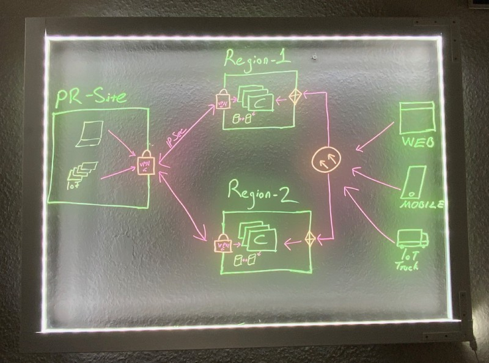
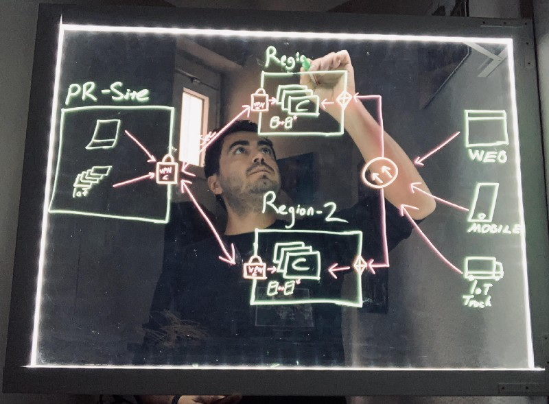
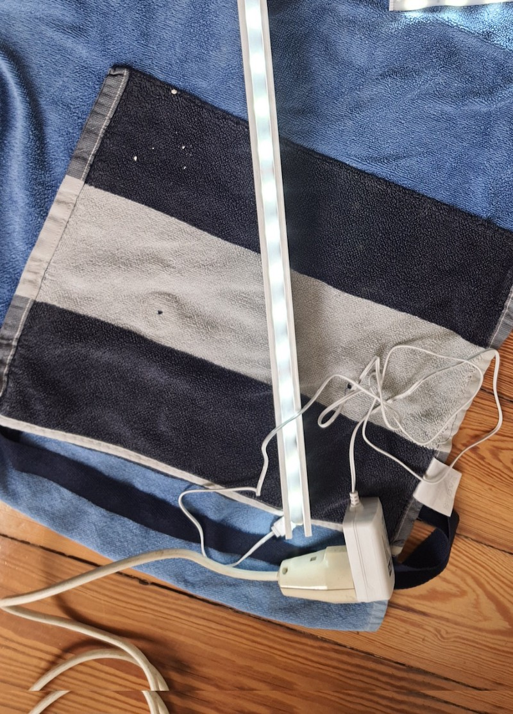
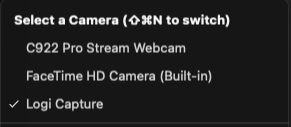

  
Working from home has become the de-facto way of working and there is no escape from it, although embracing that has been a bit hard. Now that I am behind the denial phase, I thought I do some improvements so working at home becomes more fun.

As an engineer, I do a lot of drawings, which is an essential part of sharing an idea with other engineers. Exchanging technical concepts by visualizing ideas is indispensable. Modern video conferencing solutions provide a virtual whiteboard, but it is still very limited, focus becomes the screen and the presenter becomes passive and can not utilize its body language as part of it sharing ideas.

Emily Nix, professor teaching microeconomics, want it to keep her students engaged during online learning. She has built herself a [light-board](https://www.youtube.com/watch?v=RcFyzrSFRMo) in her dad’s garage. Check the video, it is very impressive. I was very inspired by her, so finally, I gave it a try.

### The Design and Requirements

There are naturally a lot of DIY light-board videos are there, but most of them were bulky, required a lot of space. My requirements were;

* ***Compact***: I have very very limited space(the term ***space*** is exaggerated, it is a closet), so it can’t consume any additional space.
* ***Ready to use***: A solution where, I do not need to move around, that is ready to use, most of the time my drawing is in a video call.
* ***Repairable***: Things break! I do break things. My kids break them, more than I do. I needed a solution that I could exchange the pieces, and that I can fix it easily.
Given all that I want it to build a small light-board, that I can mount to the wall with a hinge(a movable joint which board will be mounted to swing open and close), that moves only 0 to 90 degrees. So whenever I am not using I can simply close it. This won’t consume any space, and I can use it for different use cases.

You can see the end result here, the first image is when I am behind the board and the view from the computer camera. While the second one is when the board is closed. As I used the board from the behind, second image may look weird to you, as image has to be flip horizontally. I added to raw image without flipping.

### Materials

I just had an idea of what I want to have, I needed a 2–3 hours stroll in the store to find appropriate parts. Here is the full list:

* ***Plexiglass***: transparent, 90x60 cm, 0.5mm(although 0.3 would just do fine)
* ***LED Stripe***: Warm white, 2.5 m
* ***Hinge***: 300 x 200 x 30 mm (2x for the fixating frame to the wall)
* ***Edge profile***: Used for frames 1.200 x 45 x 22 mm (4x) The wood profiles were already carved. The carved space was 1cm. I am not sure for what purpose it is used, but it was exactly what I need it.
* ***Corner bracket***: 100 x 15 x 100 mm, To fix side of the frames to each other
* ***Wood paint***
* ***Wood screws, dowels***
* ***Neon Markers:*** x 4
The total cost of the materials including the markers was 145€ (excluding the wood paint).

#### The Frame

I was very lucky to find the appropriate frame, I had to shorten the original sizes with a tooth saw. The edges, you see on the picture were there on purchase, I have replicated the edges on the pieces I have cut, so I could use them as pluggable frames.

My wife suggested that the frames should be white and that the light-board would look much better on the wall. She was kind enough to do the painting. She was right!

 
The frame pieces were already carved, but the width of the LED stripe was 1mm wider, which made the laying LED into the wood much harder.

### Hinges

I use two hinges which were meant to be used vertically, according to spec it could carry up to 200kg, although I am not sure, whether my very(very) thin wall would be able to handle that load. The hinge locks once it is open, so the board becomes stable and does not move around.

### The Camera Setup

I was aware that the image has to be mirrored in a video call(horizontally flipped), so the viewer can read and understand the content the way I view it. Most video conferencing solutions have an option to mirror the video, but the mirroring is not streamed to the other viewers. Which turns out to be a small problem. In nutshell, the image below describes my problem:

That also meant I needed to upgrade my camera, I ordered Logitech C922 Pro HD, it has decent video quality. Cameras do not mirror the image by default, you need to change the settings, and be aware not all the cameras have the features. Logitech also provides software called [Logitech Capture](https://www.logitech.com/en-us/product/capture), which captures the raw image from the camera, manipulates it(in this case: flip horizontally), and then creates a new video stream. The newly created video stream can be used as a video source by other applications. The image below shows that in the camera selection menu of the Zoom, you can see the Logi Capture as an input.

Naturally there were no documentation that I could rely, but I am happy I could figure it out in couple of hours. Zoom, Google Meet and Webex could recognise the video input stream but not Microsoft Teams, tested only on macOS.

### Other Learnings

Darker the room the better the light-board looks. My desk has a 34" wide screen monitor, camera is attached to the monitor. As you can imagine, there is a lot of light being reflected from my screen to the light-board. So turning off the monitor was an easy solution, as my notebook had smaller screen on the side, that was not reflecting the image.

Microphone was functional, but distance from the camera has an impact on voice quality, which I may address in the future.

That’s it!

  