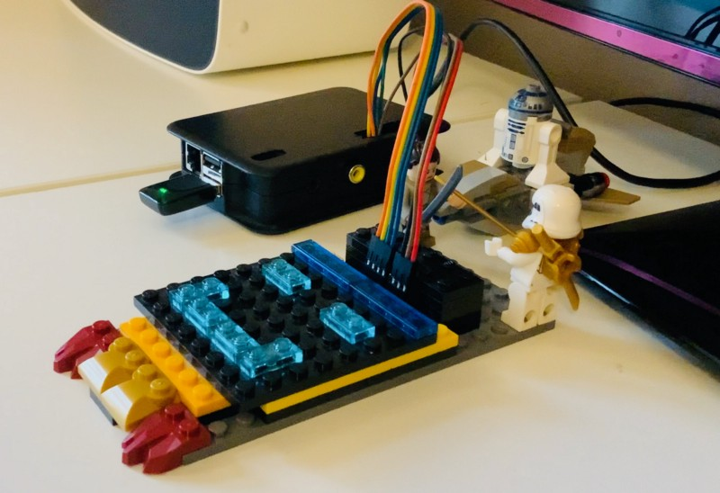

  The corona pandemic has forced digitalization in countless different domains to adapt and overcome their hurdle in the crisis. Some with success, some with failures. This post, however, will focus on something more fun, such as how we have digitized the [advent calendar](https://en.wikipedia.org/wiki/Advent_calendar)of my 4-year-old daughter.

My daughter, like all kids, loves listening to stories. Naturally, we have different mediums at home, Spotify for streaming, CD players(with lots of scratched CDs), a library app where we can stream audiobooks for kids. As an advent calendar gift, my son(10 years old) proposed that he can record short stories that she will receive every day and listen.

Here comes the challenge, ***how do you enable a 4-year-old child to open a digital gift and listen to it?***

I knew about the Toniebox, a speaker&player, which recognizes a figure that you place on the box, and it plays the story that the figure is associated with it. I thought I would be able to build something similar. After some investigation, I decided the path to go forward would be to use Raspberry Pi, RFID, NFC tags, and Sonos speaker. Before going into the details, here is the video that shows how is it working:

Controlling Sonos with RFID/NFC Tag and Raspberry PiWhat I love about this is, giving total control of what she wants to listen to her, without needing to interact with an additional device or grown-up to control device. With a single swipe, she will be able to play from a catalog(although a small one for now) stories. I presume topping this user experience will be very hard!

Now to the details!

### Raspberry Pi and RFID

I have ordered an RC522 Module RFID Reader and used an old Raspberry Pi Model B from 2011. The module is relatively simple, and there are several available software libraries which makes it very easy to start using it. Naturally, some small amount of soldering is required.

I have soldered it in a way, that I can hide the RC522 Module easily in a lego cover. My daughter, not knowing what is it for helped me to build the casing with the lego to protect the RFID Reader, and make it look a bit more child friendly.

### Mapping NFC Card to a Story
I have ordered pack of 40 NFC tag, they are very cheap, each around 30 cents. Each NFC card was meant to play a single story. As recording stories takes time, I took a very simple approach. I recorded UID of the each NFC tag and made a simple look-up table. Every time, an NFC card is swiped, the software reads the UID and finds the associated story, and then makes a request to the speaker to play it. This enabled me to finish everything, and soon as the recording are completed, I just have to update the look-up table with URIs to each story. Naturally, we also created simple stickers to give a hint which NFC card has which story. Each one will be wrapped and labeled.

### Recording and Streaming Stories
We used Voice Memos to record and Garage Band to edit it. The result has been converted into MP3 and uploaded into YouTube Music. I picked YouTube Music for two reasons:

* It is possible to upload MP3 files to your own library
* It is possible to add YouTube Music as a service into the Sonos speaker.
That enabled me to upload any MP3 file that I prefer, and I would be able to stream it to Sonos speaker.

### Controlling the Sonos
Sonos has a SOAP-based API, that can be used to control the speaker in the local network. I have used the python-based [SoCo](https://github.com/SoCo/SoCo) library for this purpose[.](https://github.com/SoCo/SoCo.) I needed it to debug for a while to understand how the API is working, using Wireshark to sniff the network traffic helped me to understand relatively quickly.

One of the problems was that the URI track was not predictable, and there was no documentation, for instance, the following URI refers to a track on YouTube Music:

> x-sonos-http:ALkSOiEoEWUxysHV11Xztvyu9pBRpeI-GSwuWszjG-dG0ZVt.mp4I am sure there is an explanation of this URI how it is hashed, but I could not find any documentation. So finding the track URI meant, I play the track and ask via API the current track URI is, which is not pleasant.

To control the speaker IP address has to be known, to make sure that the IP address is not changed over time, I used the IP reservation feature of the Google WiFi router.

### Software

I used python to read the NFC tag, make a look up to find out the UID and play the MP3 file on Sonos. As I was using the existing libraries the code was only several lines long. However, there are a lot of error cases for a such a system: network failure, OS reboot, process failure, etc. I didn’t want to address any of them directly, so I used [supervisord](http://supervisord.org/) to monitor and control the process.

Furthermore, I used Ansible for setting up the OS, installing dependencies, and deploying it. The whole code is open source and can be accessed from the GitHub:

::github{repo="enginyoyen/rfid-sonos-controller"}

### Wrap Up
I have always been on the side of giving more control to kids, rather let them try and fail(I also might be too lazy), so I am relatively happy with the solution. It is very generic and can be applied to sources as well, for instance, associating NFC tags with audiobooks on Spotify.

That all being said, happy Advent!

  