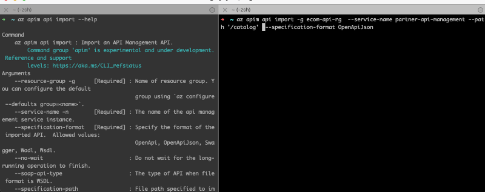
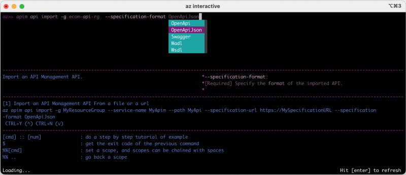

Organizations are in a tight race to develop software faster to deliver value and innovate. Developer productivity is a key to getting ahead in the race for innovation and business performance. Cloud technologies have become the bedrock for this race and support developer productivity.

Being a developer myself, I am aware that starting with new cloud technology from the ground up is not only an overwhelmingly difficult task but also a very challenging one. In this article, I will touch on 6 different technologies and ways that they can increase developer productivity individually and for the whole organization. Hoping newcomers to Azure would enjoy those tips to increase productivity.

PS: Tools are only part of a story. [The SPACE](https://queue.acm.org/detail.cfm?id=3454124) framework captures different dimensions of productivity, if you are interested in how you can raise the bar you should read it.

### 1. Azure CLI Interactive Mode: Technology Guidance

Learning a new command-line tool is not that difficult. However, CLIs are becoming more and more interface for complicated and very large software systems. Therefore, learning all commands becomes an impossible task, and time-consuming to find the right one. Trying to find the correct instruction is like fishing. You may get lucky(eventually)!

Here is a straightforward example, on the left side is the documentation, on the right is the code execution.

There is a better, easier way to do that with ***Azure CLI interactive mode. ***In nutshell, interactive mode places you in an interactive shell with auto-completion, command descriptions, and examples. In the screen below, trying to do the same task as above, but this time, there is a code completion as well as an example that is presented by the interactive shell.

az cli in interactive mode

Furthermore, you cab execute bash commands while you are in the interactive mode(e.g. *#ls*).

You can start using it with `***az interactive***` command. It is a very useful tool, that saves a lot of time for newcomers.

### 2. Resource Groups: Experimentation and Learning

The amount of technology that any cloud provider offers do vary, yet all have one thing in common: they offer a lot of technologies. Without experimentation, there is no learning. Organizations willing to support learning and experimentation rely on a dedicated setup for this purpose. This is great. The challenge that surfaces very quickly is what to do with all the resources that have been created. Meaning;

* ***Stale resources***: Some resources will be left running(sometimes forever), this has an impact on both environment and finance.
* ***What has been created?*** : Technologies have dependencies. Creating a resource can mean, other resources have been created for your convenience automatically. For instance, if you create a Kubernetes cluster, there will be a VNet, subnet, NSG, etc. Keeping track of these extra resources and knowing what they are is crucial on the learning path.
* ***How can it be deleted?*** : Part of experimentation: What has been created must be destroyed. But how do you identify what needs to be destroyed?
Resource groups do address those and similar issues. It is a container that holds related resources for an Azure solution. Resource in this sense can be anything, a virtual machine, a kubernetes-cluster, VNet, storage, etc. These constructs in return would enable you to:

* See all resources that are automatically created, which is great for beginners and experimentation
* Once the Resource Group is deleted, all the resources under that group will be deleted as well, which makes it easy to operate and saves a lot of time
* You can create very simple pipelines to see which resource group belongs to who, and either send a notification to clean up stale resources or automatically purge them.

### 3. Azure Load Testing(Preview): Determining quality of service

In today’s world, the expectations from software systems are very high. Users demand fast, fully functional systems with a good user experience, irrelevant of the use-case (buying clothes, sending an email, transferring money). SaaS solutions tend to have a *Service Level Agreement(SLA), *either because of legal liabilities or to have an in-house quality measurement. Overall, most organizations are interested in having a reliable, scalable system that can handle the unexpected surge of usage.

Load-Testing, simulating a large number of users for an application under test, is a method to determine and measure *the quality of service (QoS)*. It is a common method that is used to bring visibility to the breaking point of systems.

Although there are enough tools to build&execute load tests, it is a very tricky topic, for various reasons:

* Scaling load tests(simulating more users) means you need to be able to have more compute resources. Furthermore, a reliable test requires separation on a network level. You can’t put a load on your services running on Kubernetes cluster with tests being executed on the same cluster!
* Most CI/CD pipelines have support for it, but there is an inherent difficulty to make a good integration: problems range from network-separation of build tools to using build-system for many different tasks limiting the ability of a good test execution.
* Data collection and reporting and alerting: Although execution history is there, historically all this data has been in a CI tool, but any advanced analysis has been very limited or non-existing.
Azure Load Testing(Preview) addresses these issues, it is a fully managed load-testing service that enables you to generate high-scale load. What I like most about it is, that you can define your test with JMeter, which is already a very popular tool, and you can use the same code for executing your load-test on Azure Load Testing(Preview).

Azure Load Testing on [Microsoft Docs](https://docs.microsoft.com/en-gb/azure/load-testing/quickstart-create-and-run-load-test?wt.mc_id=loadtesting_acomresources_webpage_cnl)

It is in the preview, yet, it is a tool that will make life much easier for lots of engineers. Unless a managed service is used, most engineers need to spend a good chunk of time to figure out how to build and execute a reliable load-testing pipeline, this service enables you to just focus on what tests need to be executed.

### 4. Azure Policy: Resource Governance

Traditionally, software engineers who built software didn’t deploy it to the production systems, which may sound like a good separation of concern, but in reality this had many drawbacks. In recent years, the trend has been that “***those who build a software are responsible for running it***”. This approach does indeed work and it has great benefits. Naturally shifting of responsibilities meant that software engineers needs to be more involve in the infrastructure where the software runs. This also means they need to consume more and more information to make the right decisions. For instance, where does the software run? Is there a location restriction? Is there any security and regulatory compliance do they need to follow, etc, etc?

Naturally, over time all these questions are somehow answered, and engineer can deploy their code to the production. But this is a painful process, simply teams that are developing software are not in charge of taking all the infrastructure, security, regulatory compliance decisions. They are involve in almost all of them, but distributing knowledge equally among everyone is extremely hard.

This can be address with Azure Policy, it is a tool that helps organisations to enforce or monitor organisation standards, which can range from implementing governance for resource consistency, regulatory compliance, security and cost. It is easy to use and assign policies, it is managed, and comes with a compliance dashboard to provide a detailed overview of the whole environment.

To give some example of what you can do, you might want to disallow untrusted images to be used in Kubernetes cluster or restrict the locations where resources can be deployed or enforcing managed-identity in functions. Azure Policy, can either enforce or monitor the resources to see whether they fulfil the policy definition. Policy definition are JSON files, composed of business rules, and there are built-in definitions which are ready to use immedialtey.

The range of policies is very broad which makes it a very valuable tool for organisations but to my point it makes the life of engineers particularly easier(assuming there are defined policies) also brings confident into the software development process to catch failures.

### 5. Event Hub: Event-driven architecture

Event-driven architecture has become more and more important with the raise of micro-services. The two architectural style goes almost hand-in-hand. There are naturally many event-streaming solutions out there, Kafka is a very popular technology, which is very efficient even on set of modest hardware it can do millions of read/write operations per second. There are other alternatives, and any cloud solutions out there, also have built-in managed service for event-streaming.

From the software development perspective, any software relying on the event-streaming solution is naturally using the client-libraries that are provided. Going back to Kafka, if your application is using Kafka, you will be using kafka-client, your code has been structure around the kafka architecture, furthermore you will have probably tests that use something like embedded-kafka to make sure code that you wrote does indeed work as expected. Although this is totally natural, it also means that if you change your event-ingestion service, you also need to change your client-libraries, your code, your tests, etc. This is the normal and expected in the whole industry. But in this particular case there is an alternative: Event Hubs!

Azure Event Hubs is a data streaming platform and event ingestion service. It has a lot of features, but I will limit my self to two:

1. You can connect to event hub with native clients or Kafka-client.
2. You can capture the data and store on the Azure cloud storage without any effort(Literally)!
On the first point, it is amazing to be able to connect to different event-ingestion technology by simply exchanging the connection settings. On the second point, it is a common issue to think what do you do with the data that has landed on the event-ingestion service? Some cases, it is totally fine to purge it after certain amount of time, other cases you may want to back that up. Although, you can always build a custom solution, event-hub has the data-capture functionality that you can simply enable it without any effort. Both of these features do save engineers time and allow them to focus on what matters.

### 6. Azure Active Directory: Governance, ease of access and integration

Growing organisations always do face the question of how to govern identity of their users. What can users access? What can they not? Can they use their own devices? What and how on-boarding and off-boarding happens? While most of these questions are meant to protect the organisations resources, employee productivity also has to be considered. At the end of the day, you want to give a seamless access and experience to your employees so they can do their job efficiently.

Turning to the perspective of software engineers, there is a great deal of complexity in the tools that we use but also we need a room to experiment and try out new solutions without hassle. Azure Active Directory bridges the gap between increasing productivity while handling identity governance.   
For instance, in case if you are trying logic apps, you can integrate easily with Outlook to send an email, it is several clicks and ready. In less than 3 minutes you can build a simple HTTP(s) endpoint that receives a JSON, parses, sends an email with the incoming parameters.

Another example, if you are building a consumer facing application you can leverage the Azure Active Directory B2C to enable your users to login into the your application and enable features such as social-login, not keeping your self busy installing or maintaining another identity-management solution.

My last example, you can build a logic app that you can open up to internal use by integrating with Azure Active Directory, which means people in your organisation can authenticate themself with their credentials and use it. This is great solution for internal applications and it is not time consuming for development teams.

### Wrap-Up

The solutions that are depicted here are examples of how to increase developer productivity, on a single dimension. It is overt, yet worthy to mention: doing this by not relying on a single tool but providing an eco-system of an interconnected system.

  