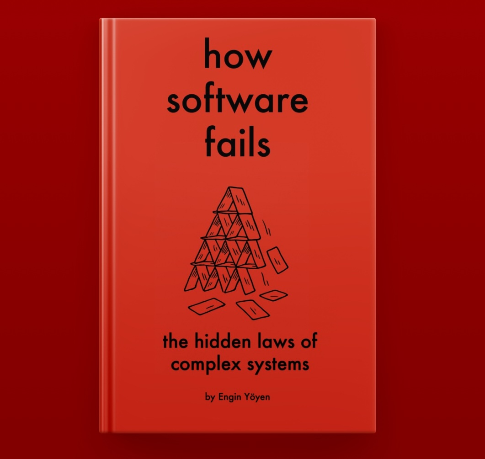

This has been coming for a long time now. Those I've worked with know that I enjoy writing, so here it comes: I've finally finished my new book: **"How Software Fails: The Hidden Laws of Complex Systems"**

What started as a book for software engineers evolved into something more, a popular science work that bridges software failures and complexity theory, psychology, and insights from scholars such as Richard Cook, Daniel Kahneman, Nassim Taleb, and more.

The book examines real-world case studies—from cosmic rays affecting hardware to configuration files causing massive outages, from radiation therapy accidents to complete city government collapses, uncovering the hidden patterns behind these failures. Each chapter provides practical insights for anyone managing complex systems.

## Available Now

The book is available in multiple formats:

- **eBook**: [LeanPub](https://leanpub.com/how-software-fails), [Apple Books](https://books.apple.com/us/book/how-software-fails/id6751854781), [Google Play](https://play.google.com/store/books/details?id=J22DEQAAQBAJ), [Barnes & Noble](https://www.barnesandnoble.com/w/how-software-fails-engin-yoyen/1148225245?ean=2940184616490)
- **Audiobook**: [Apple Books](https://books.apple.com/de/audiobook/how-software-fails-the-hidden-laws-of-complex-systems/id1839176464?l=en-GB), [BookBeat](https://www.bookbeat.com/at/book/how-software-fails-1728714)
- **Paperback**: [Amazon](https://amzn.eu/d/b9KyqFX)

Feel free to grab a copy!